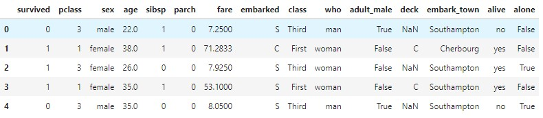
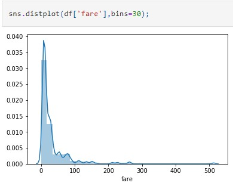
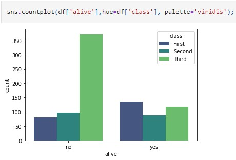
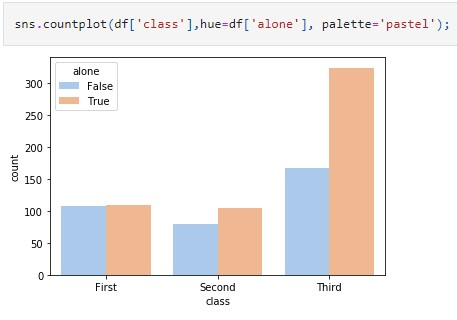
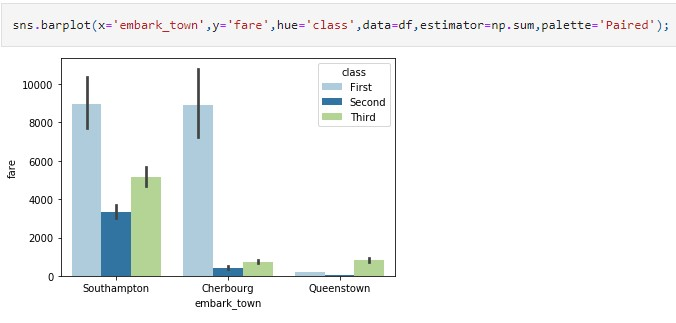

# Visualization-Titanic-Dataset
<h3>making some visualization in Titaniv dataset with seaborn</h3>
 
<a href="https://www.kaggle.com/c/titanic/data/" target="_blank">We could find data description in this link</a>
<b>
<h3>Snapshot of the content in this jupyter file</h3>
  
 

 

 

 

 

